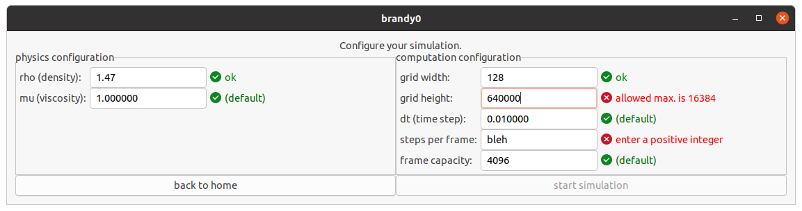

# brandy0
brandy0 is a fluid dynamics simulator.

brandy0 is a maturita project and is currently in development.

## state of development

#### the start (home) screen as of 2020/12/4


#### the simulation configuration screen as of 2020/12/4


## dependencies (refering to original experimental simulations -> partially outdated for main project)
* Eigen 3.3.7 -- available [here](https://gitlab.com/libeigen/eigen/-/releases)
* CImg -- available [here](http://cimg.eu/download.shtml)

## running a simulation (refering to original experimental simulations -> mostly outdated for main project)
1. install the dependencies (for CImg, download the header file into the source directory)
2. compile one of source which you want to run. E.g.
```
g++ -pthread XXX.cpp -O3 -o XXX -lm -lX11
```
3. run the compiled executable and it will generate output image files into `../output` by default (that folder should exits)
* note: older experimetal versions output image files into `.`
