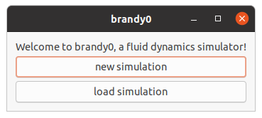
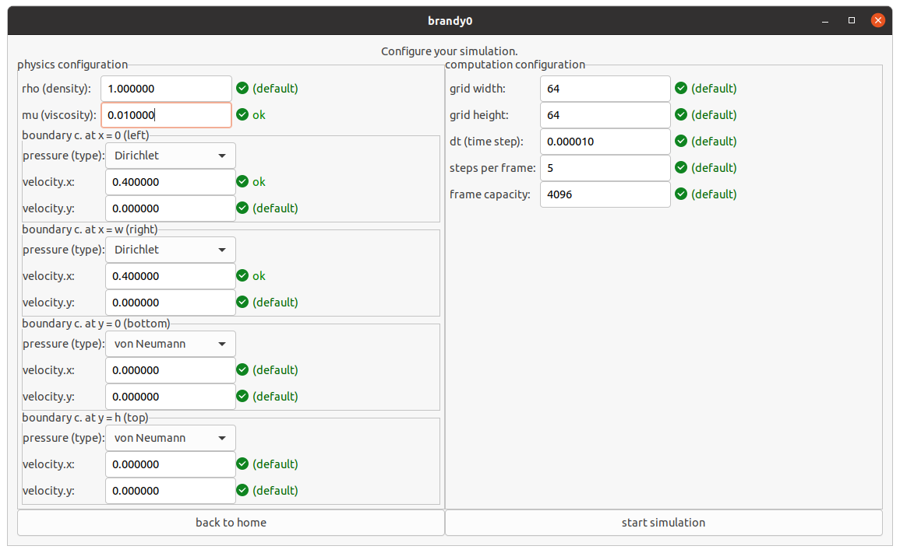
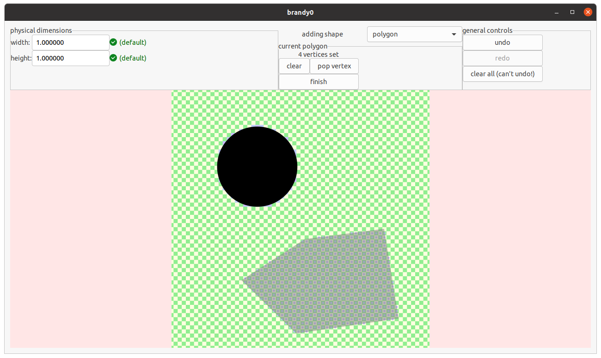
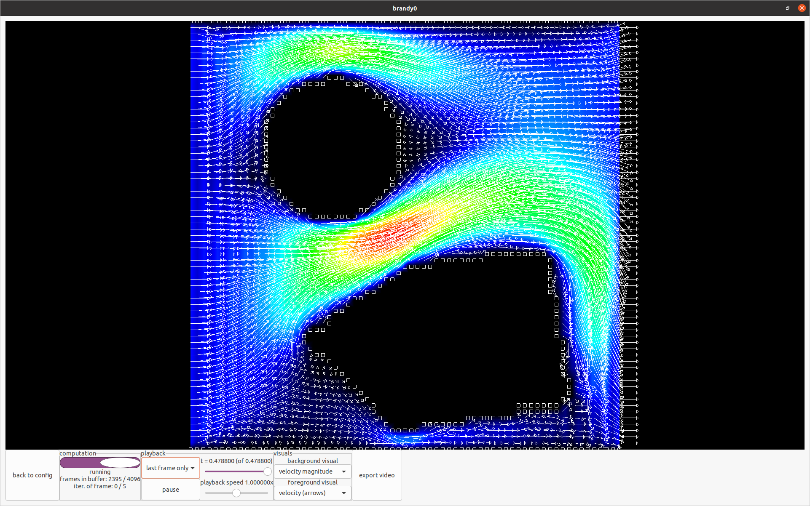
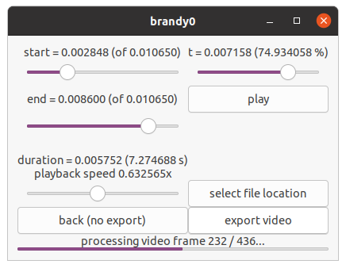

# brandy0
brandy0 is a fluid dynamics simulator.

brandy0 is a maturita project and is currently in development.

## state of development

#### the start (home) screen as of 2021/02/28

#### the simulation configuration screen as of 2021/02/28

#### the obstacles configuration screen as of 2021/02/28

#### the simulation screen as of 2021/02/28

#### the video export screen as of 2021/02/28

## dependencies
* `libavcodec`, `libavformat`, `libavutil`, `libswscale` (for video export)
* `gtkmm` 3 (C++ interfrace for GTK 3)

## how to compile and run
* have (the development versions of) the above library dependencies installed
* have `cmake` installed
* create a `cmake` build directory that builds from the source in `./src`
* let `cmake` build
* run the `app/brandy0` built by `cmake`

## licensing
Parts of this project are licensed under various licenses. All files in the doc/shots directory are licensed under the GNU General Public License. See the doc/shots/LICENSE file for the full license text. All other files (the contents of the src directory and this readme file) are licensed under the MIT license. See the LICENSE file for the full license text.
